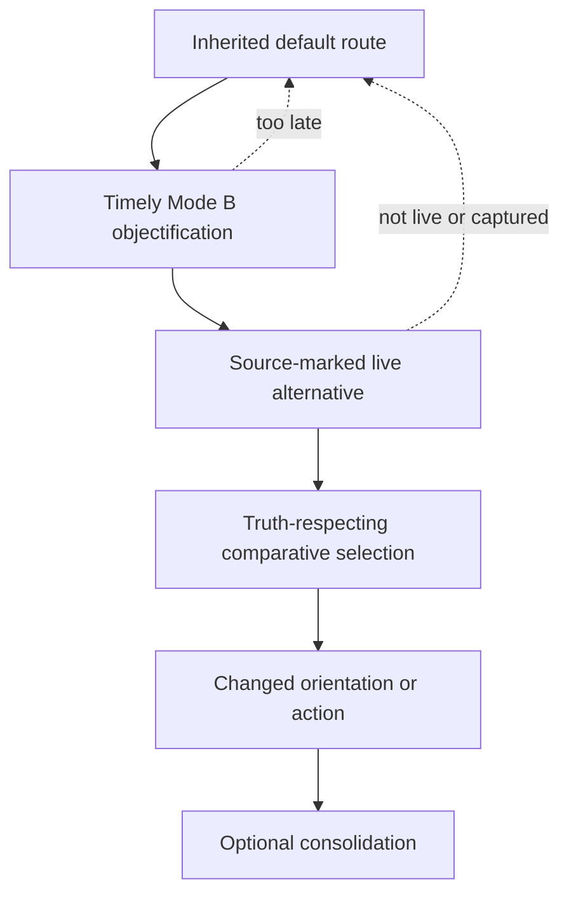

**Status:** Application paper, first draft v0.1.0. Interpretive, architectural, and empirical claims are separated in the claim ledger. All new behavioral predictions are **UNVERIFIED**.

**Builds on:** TLICA Foundation v5.3.3; *Temporal Phenomenology*; *Differentiated Affect*; *Free Will*; *Agency Architecture*; *Out of the Cave*; *The Cold Frame*; and *The Self-Applied Architecture*.

**Dependency maturity:** Main-branch placement does not imply empirical confirmation. *Temporal Phenomenology* v1.0 and *Differentiated Affect* v1.0.2 are marked complete in the repository; *Free Will* v0.3.0, *Agency Architecture* v0.3.0, *The Cold Frame* v0.4.3, and *The Self-Applied Architecture* prose v0.1 remain drafts; *Out of the Cave* v0.1.2 is an early draft. The Self-Applied prose v0.1 file is the latest full prose draft, while its numerically higher v0.8 ancestor is a pre-prose working architecture.

**Developmental comparison:** *The Cave's Lagrange Points* v0.1.0 is considered as a provisional first-draft companion paper. This paper does not treat it as canonical or empirically confirmed.

**Source note:** The user-specified [recording](https://www.youtube.com/watch?v=xoblutORPNA) fixes the target as Wallace's delivered May 21, 2005 Kenyon address. Close reading uses the [Harvard-hosted transcription](https://people.math.harvard.edu/~ctm/links/culture/dfw_kenyon_commencement.html) as an aid. [Kenyon's provenance account](https://bulletin.kenyon.edu/article/from-the-archives-everlasting-speech/) separately documents the widely circulated Devin Thompson transcription from a Hi-8 recording. The publisher's [*This Is Water*](https://www.littlebrown.com/titles/david-foster-wallace/this-is-water/9780316068222/) is a later book presentation and is not assumed textually identical to the delivered address. The cultural analysis also uses Wallace's full, unedited [2003 ZDF interview](https://www.youtube.com/watch?v=iGLzWdT7vGc), read against its manually prepared English captions; [Open Culture's archival note](https://www.openculture.com/2012/02/david_foster_wallace_the_big_uncut_interview_2003.html) independently identifies it as the raw 84-minute German public-television interview.

**Canon discipline:** Repository documents on `main` control where they conflict with exploratory branches or conversation-derived proposals. Prior TLICA chat sessions were used to recover the author's motivating question, terminology corrections, and the proposed Contextual Reorientation Loop. Chat-derived material is identified as such and is not silently promoted into the theory.

# 1. Abstract

David Foster Wallace's 2005 Kenyon commencement address can be reductively summarized as an instruction to be compassionate or mindful. Its more exact practical structure is this: ordinary consciousness is governed by conditions that become nearly invisible through familiarity; attention and interpretation therefore tend to follow a default first-person route; education can make that route available for inspection; and repeated practice can create a small but consequential freedom to orient differently. His 2003 ZDF interview supplies the social half of the diagnosis: commercial and media systems can amplify appetite, insecurity, speed, distraction, and self-advancement because those routes are economically useful. The water is not only perspectival and inherited; parts of it are deliberately produced, selected, and reinforced. The speech marks its specific charitable vignettes as unverified possibilities, repeatedly emphasizes effort and difficulty, and does not establish that consciously selecting a construal makes it factually or morally sound. The interview likewise resists the claim that American culture is uniformly evil. Together they suggest a discipline for making an automatic frame contestable inside an environment that may profit from keeping it automatic.

The Two-Layer Identity-Correlation Architecture (TLICA) supplies much of the machinery presupposed by that discipline. It distinguishes present contact $\kappa$, toolkit-relative truth-indistinguishability $\phi$, and identity-correlation $\rho$; separates phenomenal availability from verification access; models the development of a lived-I network around an indexed core I; and describes Mode B reflexive access, verification pathways, fallible source attribution, affective salience, focus, live-option construction, willing, capture, ownership, and frame closure. Its application stack provides structural resources for modeling why merely hearing a truth is insufficient and why knowing a fact about one's mind need not change what one does.

The existing application stack distinguishes reflective availability from exercise, but it does not isolate a unified present-indexed transport object. A person may possess accurate self-knowledge, have non-confabulatory Mode B access available in principle, and still fail to retrieve that knowledge before a default selection closes. This paper isolates that transport problem. Its online form is an application-level composite called **present-indexed reorientation**, or **micro-periagoge**: the current default becomes an actual Mode B object; relevant self-knowledge is activated before selection; at least one alternative becomes genuinely live; fact, inference, imagination, source attribution, confidence, identity, and value remain distinguished; and an internal orientation can be selected and implemented without preemption, bypass, or capture. A second, developmental transport route occurs when prior micro-periagoge and practice have contributed to learning that changes toolkit operations, retrieval cues, salience structure, habits, or substrate dispositions. Compiled transport is a descendant of online reorientation, not another instance of the same reflective event.

The central result is deliberately limited:

> Self-knowledge can enlarge agency only when it becomes causally active before selection or has already been compiled into the processes that structure selection. When it makes a default frame contestable and reopens a live alternative, truth-respecting choice becomes possible—not guaranteed.

This is an architectural transport claim, not a theorem that self-knowledge produces truth, virtue, or the uniquely right action. TLICA currently lacks a formal representation-to-world satisfaction relation, a complete action policy, and a sufficient normative theory. High $\phi$, high $\rho$, preservation-ranking $\Pi$, felt resonance, ownership, and profile coherence can all occur in false or harmful configurations. Accordingly, this paper treats resonance as a signal or downstream selector among live paths that have passed the paper's provisional epistemic and ethical screens, never as evidence of truth.

The aim is moral without being hagiographic. The author does not offer herself as evidence that understanding the architecture makes a person good. She reports repeated moral shortfall, continued effort, and Wallace-like first-person defaulting as her leading explanation for most such failures. That self-classification motivates a mechanism to test; it neither establishes the cause of any episode nor settles responsibility, repair, or prevention. The practical target is not moral purity but becoming better configured to recognize and enact a defensible course before the interval for doing so closes.

The Wallace analogy is therefore real but bounded. Wallace supplies a practical ethic of attention and other-regard together with a critique of institutions that monetize unreflective appetite. TLICA supplies structural resources for describing the operating mind through which a conscious person may try to enact the ethic and through which an environment's repeated signals acquire causal force. Their intersection is not the power to choose truth. It is the possibility of learning how one's own selection architecture and environment work well enough that, when presence arrives in time, inherited or engineered routing need not have the final word.

**Keywords:** attention; agency; consumer culture; default setting; David Foster Wallace; metacognition; micro-periagoge; moral fallibility; presence of mind; resonance; responsibility; right action; source adequacy; truth; Two-Layer Identity-Correlation Architecture

# 2. The motivating problem

## 2.1 The life-project

The motivating aim of this paper is not merely to understand a public speech. It is to state a life-project in architectural terms:

> Understand the intersection among capital-T Truth, consciousness as the I-with-a-field, the operating mind through which contents become available and action is organized, and the still-unresolved demand to do the right thing—so that, when there is enough presence to use the knowledge, an inherited response is not the only available path.

Four terms must remain separate for this aim to stay coherent.

1. **Capital-T Truth (intrinsic truth)** names what is true independently of a mind's preference, identity, recognition, or felt resonance. TLICA formalizes an intrinsic structural domain, but it does not yet establish that this exhausts Truth or provide a general representation-and-satisfaction relation by which the operating mind can identify arbitrary truths.
2. **Consciousness as the I-with-a-field** is the author's explicit meaning of “I,” recovered from the TLICA sessions. Within the foundation, the indexed core $\hat\iota_m$ anchors self-identity inside that field; it is not a reduction of consciousness to a point. Body, biography, memory, social personhood, and the acquired lived-I network are not silently substituted for consciousness.
3. **The mind's operating architecture** includes substrate constraints, contact, salience, affect, focus, verification tools, fallible source attribution and verification-pathway access, identity-correlation, preservation-ranking, live-option construction, and action implementation.
4. **Doing the right thing** is a normative problem. It is not defined by resonance, contentment, self-preservation, identity fit, social approval, or descriptive accuracy alone. On the author's stated ethic, responsible action must remain answerable to Truth, but this is an application-level normative commitment rather than a TLICA deduction. A list of descriptive facts does not by itself settle what should be done when care, justice, loyalty, autonomy, safety, uncertainty, and competing persons' claims conflict.

The project is about their intersection, not their collapse. If intrinsic truth is reduced to what resonates, the project becomes self-confirmation. If the I is expanded to mean every feature of the person, the architecture loses the correction that consciousness and its acquired profile are distinct. If mental operation is treated as transparent to introspection, the very default processes under investigation disappear from view. If rightness is reduced to whatever the architecture selects coherently, the theory launders preference into morality.

## 2.2 A fallible moral standpoint

The authorial standpoint is not “I understand minds and therefore exemplify moral success.” It is nearly the reverse:

> I am not saying I am some beacon of moral value. I constantly fail at being good, but I try, and when I fail it is mostly due to what Wallace talks about.

This is an autobiographical report and research motivation. The “mostly due” clause is treated as a leading hypothesis about the author's failures, not as a validated causal classification. Fatigue, frustration, appetite, fear, injury, habit, self-centered immediacy, and socially reinforced scripts can make one construal feel exhaustive before an alternative the person would reflectively endorse becomes live. Individual episodes may involve, alone or in combination, ignorance, unresolved value conflict, external constraint, rationalization, untimely reflection, or conduct deliberately selected despite the author's own contrary judgment. The architecture must permit those rivals rather than turn every moral failure into an automatic-process alibi.

The Wallace-shaped case can nevertheless be specified precisely enough to test: a person can possess and endorse a moral consideration outside an episode, sincerely want to honor it, and still fail to make it operative before selection closure. This defines a possible transport failure; it establishes neither that the consideration was objectively right nor that transport failure caused any particular autobiographical episode. The relevant gap is between an **endorsed moral consideration** and **timely, live, implementable moral agency**.

Understanding that mechanism does not by itself erase or establish responsibility. Causal explanation, degree of control, culpability, repair, and prevention are different questions. A causal account may bear on culpability, including mitigation, but it neither entails full exculpation nor determines what apology, restitution, boundary change, or practice is owed. Those judgments require episode-specific facts and ethical standards outside the transport model.

Earlier self-applied working drafts and TLICA sessions gave the moral aim a useful non-absolute formulation: **set up to be able to be good**, rather than treat moral purity or guaranteed harmlessness as the success criterion. This is the author's developmental commitment, not a theorem, universal obligation, or wellness score. It makes failure part of the data and continued reconfiguration part of what the author commits herself to.

## 2.3 The exact research question

Existing TLICA papers already ask how a mind acquires tools, forms a profile, differentiates self from not-I, experiences a present, constructs live options, becomes captured, escapes a frame, and applies its own detector to itself. A broad new paper about awareness, enlightenment, attention, or truth would therefore duplicate the existing application stack.

The unfilled question is narrower:

> How does knowledge of one's own cognitive architecture become causally active early enough in a present encounter to change the live options from which attention, interpretation, and action are selected?

Call this the **epistemic-to-agential transport problem**, or more compactly the **availability-to-exercise gap**. *Agency Architecture* already distinguishes availability from exercise and identifies reflective object-domains. The novelty here is to isolate those materials as one target-relative process with timing, source-attribution discipline, liveness, selection, implementation, and consolidation conditions.

The staged decomposition is:

$$
\text{possession}
\rightarrow
\text{availability}
\rightarrow
\text{timely exercise}
\rightarrow
\text{live-option change}
\rightarrow
\text{comparative selection}
\rightarrow
\text{implementation}
\rightarrow
\text{possible compilation}.
$$

Each arrow can fail independently enough to generate a different diagnosis and discriminator. A lesson remembered after an action may improve a later episode while doing nothing to alter the completed selection.

## 2.4 Thesis and non-theses

The thesis is:

> Timely, non-confabulatory objectification of a default process can reopen an episode's option-space. If a relevant alternative becomes genuinely live and satisfies source-status, evidence/calibration, feasibility, ownership, and anti-capture constraints, comparative selection becomes structurally possible. Improvement and rightness remain separately testable.

This paper does **not** claim:

- that every default is false or bad;
- that “default setting” names one psychological mechanism;
- that self-knowledge is sufficient for behavior change;
- that attention can always be redirected;
- that Mode B reflection is required for every free choice;
- that an imagined charitable explanation is factually true;
- that compassion changes intrinsic truth;
- that resonance, $\phi$, $\rho$, $\Pi$, ownership, and moral rightness coincide;
- that the architecture derives a unique right path;
- that remaining in a harmful system is more enlightened than resisting or exiting it;
- that a commencement speech is empirical evidence for TLICA;
- or that a self-applied case validates a population-level mechanism.

# 3. Wallace's argument, reconstructed

The [full delivered-address transcription](https://people.math.harvard.edu/~ctm/links/culture/dfw_kenyon_commencement.html) proceeds through the following sequence, several parts of which disappear from excerpted versions:

| Movement in the delivered address | Function in the argument |
|---|---|
| Fish and water | Obvious, important realities may be hardest to notice and articulate |
| Liberal-arts cliché | Education concerns what receives thought and how meaning is constructed, not merely cognitive capacity or accumulated knowledge |
| Alaskan atheist and believer | One event can be organized by incompatible templates; certainty can imprison either side |
| First-person centrality | The experiential field structurally privileges one's own immediacy |
| Over-intellectualization warning | Intelligence can deepen enclosure instead of freeing attention |
| Workday, traffic, and supermarket | The philosophical problem becomes concrete under fatigue and routine |
| Unlikely counterstories | Possibility generation reopens a closed frame without supplying new facts |
| Socially conscious default | Morally respectable content can still be routed through automatic contempt |
| Mystical possibility and caveat | A meaningful construal can be available without being asserted as true |
| Worship | Unconscious ultimate commitments shape what is noticed and how value is measured |
| Two freedoms | Preference-satisfaction differs from disciplined awareness and care |
| Life before death and repeated reminder | The practical discipline is lifelong and must remain conscious in ordinary life |

The frame is anti-guru from the beginning. Wallace denies being the wise fish, and near the end says the relevant truths are already culturally familiar. The problem is keeping them active in daily consciousness. This directly supports the paper's distinction between possessing a sentence and deploying a tool.

## 3.1 Why the fish story matters

The opening fish story concerns an epistemic condition: the most pervasive feature of an environment can be the hardest feature to notice. Familiarity makes a condition functionally transparent. One can operate inside it without representing it as an object.

For the present TLICA translation, the water metaphor is operationalized as a family of background conditions that organize experience while escaping focal notice: the first-person center of perspective, the fatigue that narrows interpretation, the social script that turns strangers into obstacles, the value hierarchy that decides what matters, and the habits through which attention repeatedly returns to the same objects.

The practical problem is not a lack of intelligence. A highly intelligent person can rationalize the default more elaborately. The problem is control over what receives attention and how an event is framed before an automatic interpretation hardens into the only apparent reality.

## 3.2 Education as governance of attention

Wallace rejects the thin cliché that education simply teaches a person to think. Thinking is already happening. The issue is what thought is about, which assumptions organize it, and whether the thinker can notice an interpretation as an interpretation.

The speech explicitly connects education with critical self-awareness, attention, meaning-construction, effort, and lifelong reminding. This paper reconstructs those materials into three functions:

1. exposes the partiality of an apparently self-evident frame;
2. makes attention and interpretation available as objects of choice;
3. supports the repeated practice needed for that capacity to survive ordinary pressure.

This is not unrestricted mental sovereignty. Wallace says the shift takes will and effort and acknowledges that on some days a person will be unable or unwilling to make it. The relevant freedom is therefore finite and intermittent. Treating repeated exercise as training and possible compilation is this paper's TLICA interpretation.

### 3.2.1 A fourth, interpersonal function: education as semantic infrastructure

The three functions above concern governance of one's own attention and interpretation; they are intrapersonal. The author adds a fourth function that is interpersonal, and marks it explicitly as an extension adjacent to Wallace rather than a reading of the delivered address:

4. broad shared education can act as **semantic infrastructure**—a civilization-scale attempt to install enough common conceptual structure across many minds that complex ideas travel between strangers with higher expected fidelity and lower translation cost.

The load-bearing distinction is between **agreement** and **interoperability**. The claim is not that two educated people converge on the same conclusions. It is that they are more likely to share conceptual primitives, historical examples, formal tools, metaphors, and distinctions with which a disagreement can be represented precisely rather than talked past.

Schematically, and not as a new canonical formal object, let $L_i:\mathcal W\to\mathcal R_i$ denote person $i$'s learned mapping from encountered world-structure $\mathcal W$ into a private representational space $\mathcal R_i$. Two people can inhabit the same world while $L_A(w)\neq L_B(w)$; successful communication does not require identical internal states, only enough preserved relational structure that a receiver reconstructs the load-bearing part of the sender's object. A shared library of reusable objects—Sisyphus, Plato's cave, natural selection, regression to the mean—lets a complex relational structure be transmitted by reference rather than rebuilt from first principles, so that "Sisyphean" can carry an entire model of recurring futile labor in a single word.

This function touches TLICA only at toolkit-relative $\phi$ and verification-pathway access: a shared concept can supply a previously unavailable representation, analogy, discriminator, or inferential route, and in that limited sense education can expand the toolkit closure available to a person. It must not be confused with truth. Two minds can hold the same conceptual library and share the same false model with high fluency; high interoperability can coexist with poor source attribution, correlated blind spots, or a systematically inadequate map. Shared language is not shared truth, and communicability is not correctness—the epistemic and source guardrails of §7 still apply to any concept transferred between minds. (*Transfer* is the inter-mind sense used throughout this section; it is distinct from the intra-mind epistemic-to-agential *transport* of §6, which moves a consideration from availability to timely exercise inside one mind.) Credential status is at most a noisy proxy for the actual variable, which is usable conceptual overlap, not a degree.

The underlying communication model is **UNVERIFIED** as an empirical account. It is developed, with candidate predictions and hostile controls, in the companion research note [*Liberal Education as Semantic Interoperability*](../research/this_is_water_semantic_interoperability_2026-08-09.md); its political extension, concerning what happens when the shared library thins or fractures, is pursued in [*Shared Reality, Divergent Maps*](shared_reality_divergent_maps_v0_2_0.md).

## 3.3 Belief templates, blind certainty, and the Alaskan story

Before introducing self-centeredness, Wallace gives two people the same survival event. The believer sees answered prayer; the atheist sees passing rescuers. The ordinary liberal-arts response is to note that different belief templates construct different meanings and then stop in the name of tolerance. Wallace does not stop there. He asks where the templates come from inside a person, rhetorically treats meaning-construction as personal and intentional choice, and shows how certainty can make a frame into an unrecognized prison. TLICA deliberately weakens total choice to partial, substrate-bounded agency.

The symmetry matters. He does not reserve closure for the atheist; religious dogmatism can instantiate the same arrogance. Nor does the story establish that one interpretation is correct. It establishes that an event does not arrive with its only permissible meaning transparently attached and that confidence in a frame is not proof of the frame.

TLICA translates this episode into the following discipline:

- generate rival interpretations;
- do not infer equal truth from plural availability;
- do not infer truth from certainty;
- ask how the active template was acquired;
- and preserve the probes that could discriminate among interpretations.

## 3.4 Over-intellectualization and the terrible master

Wallace then turns the warning against the educated listener. Abstract argument can become a way of getting lost inside the head rather than attending to what is occurring outside and within it. The transcript describes the constant internal monologue as hypnotic and the ungoverned mind as a terrible master.

This passage blocks an intellectualist reading of TLICA. A person can know the architecture, label every coordinate, and become less present. More Mode B content is not automatically more freedom; it may be rumination, self-display, or an additional enclosure. The relevant exercise must contact the operative process and alter the live structure of the episode.

The delivered transcript makes its stakes rhetorically extreme through a passage about firearm suicide. That passage should neither be omitted from a complete reading nor converted into clinical evidence. It intensifies Wallace's claim that unconscious captivity can become life-and-death serious; it does not establish a general causal account of suicide, and this paper does not use it as one. The later assertion that the practice is unimaginably hard also corrects any implication that attention is effortlessly or totally voluntary.

## 3.5 The default is perspectival before it is moral

Wallace calls self-centeredness hardwired from birth; the address does not establish that empirical claim. The paper's narrower structural reconstruction begins from first-person asymmetry: each person experiences the world from the center of that person's own field. Other people arrive as appearances within that field, while one's own pain, urgency, and frustration arrive with immediate force. The world can therefore seem organized around the self without the person consciously endorsing egoism.

The ethical problem appears when this perspectival asymmetry becomes an unquestioned interpretive policy:

- my fatigue is concrete, while yours is background;
- my delay is an injury, while your possible difficulty is invisible;
- my projects carry depth, while you become a role, blockage, or type;
- my present story arrives as fact, while alternatives never become candidates.

The speech does not ask the listener to deny first-person immediacy; it asks that the resulting automatic construal not be treated as exhaustive.

## 3.6 The grocery-store counterstories are possibilities, not revelations

In the speech's ordinary-life example, a tired person can construe other shoppers and drivers as stupid, obstructive, or inconsiderate. Wallace then supplies alternatives with differing confidence levels. The specific accident, hospital, cancer, and bureaucratic-kindness vignettes are explicitly unlikely-but-possible. The broader claims that others are similarly frustrated and that some probably bear harder lives are presented probabilistically. None is an observed fact available to the shopper.

The epistemic force of the specific invented biographies is modal rather than evidential. Their value does not depend on believing that any one is probably true:

> The currently dominant story is not the only possible explanation consistent with what is observed.

The counterstory breaks premature closure. It restores uncertainty, reopens a hypothesis space, and permits the stranger to appear again as a person rather than as a thin function in the observer's inconvenience. The broader burden-sharing claims can also carry ordinary probabilistic support. A specific compassionate fiction asserted as fact would merely replace one provenance error with another.

The speech also gives a socially conscious default: environmental concern about large vehicles becomes an automatic route into contempt for their drivers. Wallace does not adjudicate the climate judgment; he marks the contemptuous passage as an example of how not to think. This paper infers that potentially correct moral content can still be badly routed through certainty, dehumanization, and self-satisfaction.

## 3.7 Worship and operative value-attractors

Wallace's discussion of worship concerns what repeatedly captures attention, organizes value, and determines what feels like gain, loss, enough, threat, or success. His explicit destructive examples are money and things, body/beauty/sexual allure, power, and intellect or being seen as smart. Status, certainty, and self-importance are TLICA-compatible extensions rather than examples the speech separately enumerates.

The claim is psychologically and ethically stronger than “people have values.” It says that an unexamined attractor can consume the person precisely because its rule is not represented as a rule. The content one treats as ultimate structures salience and dissatisfaction from underneath deliberation. Wallace presents a reason for perhaps orienting ultimate commitment toward religious or spiritual traditions, or toward inviolable ethical principles, and argues that the surrounding culture reinforces less conscious defaults. Those are his practical assertions, not TLICA deductions.

TLICA can translate this into preservation-ranking, identity investment, salience, focus, and toolkit dynamics. It should not equate Wallace's moral rhetoric with any one coordinate. A worship-object may be high-$\rho$, heavily weighted by $\Pi$, affectively intense, frequently focused, or structurally central to profile consistency; different cases can instantiate different combinations.

## 3.8 Two freedoms

The speech contrasts a culturally supported personal sovereignty associated with wanting, achieving, wealth, and comfort against a harder freedom of attention, awareness, discipline, care, and repeated sacrifice. An agent with many options can remain governed by an invisible attentional routine.

The second freedom is not magic. It is an achieved capacity to notice the water and sometimes refuse an automatic interpretation. Its social form matters: this paper interprets Wallace's ideal of care and repeated sacrifice as giving other people ethical standing rather than turning self-awareness into a more sophisticated form of self-absorption.

## 3.9 Practice, not one insight

The speech closes on repetition. No conceptual insight permanently removes the default. Fatigue, pain, threat, habit, bandwidth limits, and salience pressure recur. Wallace supports repeated reminding, effort, and education as lifelong work. The proposal that such work may compile into cues, habits, and dispositions is this paper's TLICA hypothesis rather than a mechanism specified in the address.

The address places possible failure inside the practice: Wallace explicitly says the shift requires effort and that on some days a person cannot make it while on others the person does not want to. This directly supports episodic nonperformance. The speech's repeated-reminder and lifetime framing supports nonmastery, but not the stronger claim that every practitioner repeatedly commits moral failures for the same reason. The paper's sequence of trying, failing, examining the route, and trying again is an application to the author's experience—not a claim that the author has become the wise fish.

This point is essential to the TLICA analogy. An idea can be true, understood, and even identity-significant while remaining causally idle during the episode in which it is needed. Practice is the proposed transport from possession to availability and from availability to timely exercise.

## 3.10 Wallace's capital-T Truth is not a metaphysical proof

Wallace uses capital-T language at two rhetorical sites. After the counterstories, he denies that the mystical construal is necessarily true and says the capital-T point is that one can decide how to **try** to see. Near the close, he applies capital-T language to the lived discipline of attention, awareness, care, and education as a lifelong practice concerning life before death. This paper interprets the two sites together as orientational agency and a practical ethic, not infallible perception.

The speech does not establish a metaphysics of intrinsic mathematical or logical structure. Its recurring claims are lived and ethical: people are ordinarily self-centered from the inside; attention is trainable to some degree; unexamined commitments organize a life; and other people may bear circumstances absent from one's current construal.

The speech marks its speculative stories as choices about how to try to see, not discoveries of hidden facts. It also says the address is not a sermon about morality, religion, or dogma, even while recommending repeated care and sacrifice for others. The speech disclaims conventional moralizing while still advancing an unmistakably normative ideal of attention, care, and sacrifice. Its universal worship thesis is an asserted practical generalization, not a demonstrated law.

The speech's authority for this paper is therefore analogical and practical. Wallace dramatizes the operation the theory aims to explain; he does not prove TLICA's naturalist realism, its cogito hierarchy, or its formal coordinates.

## 3.11 The ZDF interview: the water is socially produced

The full 2003 ZDF interview extends the commencement argument in a direction the speech only implies. Wallace's subject is no longer only the first-person default; it is an American economic and media ecology that discovers, targets, and reinforces that default.

The interview develops seven connected claims.

### 3.11.1 Self-gratification is an economically useful message

Wallace describes a specifically American ethos in which the individual's wants and happiness are treated as the highest practical good. Parents do not normally teach this proposition directly. It arrives through many subtle messages, especially advertising and entertainment. A firm trying to sell a product has a structural reason to address the impulsive, self-centered, novelty-seeking part of a consumer.

Wallace immediately qualifies the diagnosis. America is not merely one shopping mall; the stereotype is reductive; the system produces real comfort and prosperity; similar dynamics exist in Europe; and he does not regard Americans as evil. The target is an incentive pattern, not a national essence or conspiracy.

### 3.11.2 Dissatisfaction can become demand

The interview describes a feedback loop. A culture generates tension, comparison, loneliness, and a sense of lack; commercial messages then offer purchases or stimulation as relief. Short-term relief preserves demand without necessarily nourishing citizenship, meaning, or connection. Wallace borrows economic language for this persistent demand, but his point is phenomenological rather than a demonstrated economic model.

This extends the speech's worship analysis. The operative attractor is not merely chosen privately. Institutions compete to install, cue, and reactivate it.

### 3.11.3 Freedom of choice can conceal appetite slavery

Wallace contrasts the rhetoric of having choices with the loss of control that occurs when every impulse appears to require gratification. In his addiction analogy, a wanted state gradually becomes a felt need. The crucial transition is not from no option to many products; it is from wanting to capture.

Under TLICA, this is a warning against measuring freedom by menu size. An agent can face hundreds of purchasable options while the higher-order option not to obey the appetite is absent, non-live, or captured.

### 3.11.4 Speed and stimulation weaken the quiet route

The interview's discussion of reading is an attentional diagnosis. Wallace observes a growing aversion to silence, sustained difficulty, and long residence with one object. Fast media repeatedly feeds rapid switching, while the capacity that can tolerate quiet and complex attention goes undernourished.

His own television example is exact: the remote control does not merely supply choice; it invites anxious scanning for a possibly better channel. Choice abundance can therefore destroy inhabitation of the selected object. The person remains oriented toward the next option rather than present to this one.

### 3.11.5 Irony can awaken or anesthetize

Wallace treats irony and dark humor as ambiguous tools. They can reveal a cage, but they can also let a person perform resistance while remaining comfortably inside it. Later in the interview, he notes that serious language about citizenship or existential loneliness is preemptively mocked by an internalized voice.

The relevance to Mode B is direct. Reflexivity is not inherently liberating. A reflective system can neutralize every sincere commitment by observing its own possible pretension. The ability to redescribe the cage wittily may become one of the cage's preservation mechanisms.

### 3.11.6 Deep art can cross the wall of self

Wallace contrasts entertainment that supplies temporary escape with art that confronts the reader and permits a limited inhabitation of another consciousness. Reading is slow and effortful, but its strange temporal mobility and access to another mind can answer loneliness in a way passive image-consumption often does not.

This supplies an external route to other-I standing. It does not literally grant access to another core I, and fiction does not become testimony merely because it produces empathy. It can, however, expand the toolkit's capacity to model interiority and make other-directed routing more available.

### 3.11.7 Meaningful rebellion is quiet and configurational

Near the end, Wallace rejects the cultural picture of rebellion as dramatic spectacle. He points instead to less consumption, independence from television as a world-source, sustained research before voting, and careful thought about the connection between private convenience and public consequence. These acts are visually uninteresting and therefore difficult for mass entertainment to market as rebellion.

This is configurational willing at a social scale: alter sources, cues, consumption routes, and informational habits before capture. It also joins private presence to citizenship. The person does not merely choose a kinder story inside the supermarket; the person examines the institutions deciding what appears salient, normal, desirable, and politically real.

### 3.11.8 Source limits

The interview is exploratory conversation, not a finished social theory. Wallace repeatedly calls his formulations crude, complicated, reductive, or uncertain; distinguishes American tendencies from universals; admits his lack of a cure; and identifies himself as a frightened writer rather than a political theorist. The historical context includes post-9/11 fear, the Iraq war, contemporary television, and the early internet.

Its critique should therefore be used as a source of structural hypotheses:

- environments can manufacture salience;
- commercial selection can exploit generic appetites;
- repetition can convert preference into felt necessity;
- media speed can change the cost of sustained focus;
- market and political feedback can narrow source diversity;
- and resistance may require environmental reconfiguration, not additional information alone.

The fact that this critique resonates is a reason to investigate it, not evidence that every causal claim is true.

# 4. What TLICA already contributes

## 4.1 The indexed core I and the acquired lived I

TLICA presupposes consciousness as the fact that there is an I with a field of contents and anchors that field at the indexed core $\hat\iota_m$. The core licenses indexed self-identity; it is not the body, biography, memory, acquired lived-I network, or consciousness considered as the whole I-with-a-field. Following the author's explicit conversation-level stipulation, **I refers to consciousness in this paper**.

The lived I is the historically accumulated positive-path network rooted at the core. The identity-correlation profile $P_{m,t}$ maps the whole asymptotic field—including contents with $\rho=0$—to root-integration values. The lived-I network, its marginal profile, and the whole content field are therefore not interchangeable objects.

This distinction prevents two errors in the Wallace translation.

First, a default is not “who the I essentially is.” It may be a strongly integrated route acquired through substrate, environment, repetition, or identification. Second, nonidentity between core and accumulated network prevents profile revision from becoming replacement of the core; Mode B is the additional capacity that can make accumulated structure an object of attention.

## 4.2 The three coordinates

The foundation's clearest contribution is the non-reducible separation of:

| Coordinate | Function | Wallace-relevant question |
|---|---|---|
| $\kappa$ | Source-grounded contact with primal not-I; content-level $\kappa^{\mathrm{out}}$ depends on the outside-perspective source map | What source contact is attributed to this content from the model's outside view? |
| $\phi$ | Current toolkit-relative truth-indistinguishability | How difficult is this content for available tools to distinguish from truth? |
| $\rho$ | Historical identity-correlation | How deeply is this content integrated with the lived-I profile? |

These coordinates can influence one another dynamically without becoming definitions of one another. A highly identity-correlated belief can be false. Source-grounded contact can be misrepresented from the inside. Poor probes or a limited toolkit can make a false content difficult to distinguish from truth and hence apparently high-$\phi$. Source opacity, by contrast, commonly leaves source-level $\phi$ low or undefined; it should not be treated as another route to high $\phi$. Neither $\kappa$ nor its content-level outside-perspective construction is a synonym for felt intensity.

This separation is indispensable to the present project. “Resonates with me” may describe high identity fit, affective amplitude, preservation alignment, profile coherence, or a high-$\phi$ appearance. None alone certifies intrinsic truth.

## 4.3 Availability is not verification

The status predicate $A_{m,t}(x)$ distinguishes phenomenal availability from verification access. Together with $\phi$, it supports four useful classes:

- **conscious-clear:** $A=1$, with $\phi$ defined;
- **conscious-fuzzy/source-opaque:** $A=1$, with source-level $\phi$ low or undefined;
- **latent/retrievable:** $A=0$, with a pathway constructible upon activation;
- **unconscious-operative:** $A=0$, with no currently constructible pathway while $\kappa/\rho$ or dispositional effects remain.

A Wallacean default can therefore be phenomenally invisible yet operative, vaguely felt but source-opaque, explicitly known but not timely retrieved, or clearly represented while still behaviorally dominant. A generic awareness injunction does not specify which failure is occurring.

## 4.4 Encounter, imprinting, and the toolkit

The foundation distinguishes encounters from modes of response. Direct, shadow, and self-encounter can contribute to verification-tool formation. Focus-driven and osmotic imprinting can build patterns before the person possesses language for them. Mode C integrates; Mode A differentiates; Mode B makes accumulated structures available to reflexive thought.

Wallace's water belongs here. A default can be:

- substrate-favored;
- osmotically acquired;
- affectively amplified;
- repeatedly reinforced by focus;
- integrated at high $\rho$;
- assigned high preservation priority by $\Pi$;
- or left unchallenged because no competing verification path was ever constructed.

The speech can itself be a structured encounter. It cannot insert a completed tool into another mind. Whether a listener acquires a usable tool depends on attention, existing pathways, practice, substrate capacity, later encounters, and the construction of a retrievable contrast.

## 4.5 Focus is partly self-directed and still bounded

TLICA models focus as bounded by substrate-set capacity $M_m(t)$; the human application assumes ordinary finite capacity. Later development permits partially self-directed focus but not escape from substrate, history, embodiment, or environment. This supports Wallace's practical freedom while blocking a voluntarist overreading.

A person may be unable to reorient because:

- the relevant content never becomes available;
- the interval closes too quickly;
- pain or fatigue consumes capacity;
- capture eliminates liveness;
- the alternative is imaginable but not implementable;
- the environment punishes reflective delay;
- or the toolkit lacks the distinction needed to represent the default.

Failure to reorient is therefore not automatically a moral failure.

## 4.6 Free choice and the missing exercise condition

*Free Will* defines free choice proper through six interdependent conditions:

1. contrastive live-option construction;
2. evaluative engagement;
3. operator-bundle selection;
4. substrate coupling without preemption, bypass, or capture;
5. non-confabulatory Mode B reflective availability;
6. ownership-integration.

Condition 5 is **availability**, not actual reflective exercise. That is correct for a general account of free choice: skilled and well-integrated action need not be accompanied by a running commentary. This paper translates Wallace's demand for awareness and conscious decision into an episode-specific question: is reflection exercised while the relevant target is still contestable?

The present paper therefore adds no seventh condition to *Free Will*'s application-level definition of free choice proper. It defines an episode-level composite for the subset of situations in which an inherited route needs to become an object before selection.

## 4.7 The application stack already surrounding the problem

| Existing paper | Contribution inherited here | Remaining gap |
|---|---|---|
| *Temporal Phenomenology* | The present as active imprinting interface; focus-sensitive now-ness | Presence of mind is not identical to present-focus and may use projection |
| *Differentiated Affect* | Affect changes salience, action-readiness, preservation-ranking, and profile stability | No retrieval rule that activates a relevant tool before output |
| *Free Will* | Live options, evaluation, selection, non-capture, reflective availability, ownership | Availability does not entail episode-specific exercise |
| *Agency Architecture* | Toolkit, orders of willing, source domains, habit, capture, rumination, direct/configurational/slingshot willing | Describes machinery but not the transport event |
| *Out of the Cave* | Closure, internal/external routes, frame-facing opportunities, periagoge | Operates mainly at frame and developmental scale |
| *The Cold Frame* | Modeling-routing separation, referent-thinning, visible slack, re-thickening | No ordinary-episode interrupt composite |
| *The Self-Applied Architecture* | Detector–dig discipline, affective masquerade, felt/truth-register separation, asymptotic pursuit | Does not isolate a general timely deployment condition |
| *The Cave's Lagrange Points* (exploratory first draft) | Dual fidelity, station-keeping, bounded integration, exit analysis | Operates at persistent developmental scale and is not yet confirmed |

# 5. The default setting as an architectural family

## 5.1 Default configuration

Let $e$ be a decision-relevant episode and $o$ a specified attentional, interpretive, or action target within it. Define **target-relative selection closure** $t_s(e,o)$ as the earliest point after which the consequential route can no longer be altered without initiating a new decision episode—because it has been implemented, irreversibly committed, preempted, bypassed, or captured. A complex episode can contain nested targets, later selections, or a reopened target; there need not be one simple endpoint for the episode as a whole.

A **default route** is the baseline policy or output tendency that would ordinarily dominate for target $o$. Represent it schematically, not as a new canonical formal object, by:

$$
D_{e,o}=(f_{e,o},h_{e,o},r_{e,o}),
$$

where $f_{e,o}$ is the dominant focus allocation, $h_{e,o}$ the dominant interpretive hypothesis or frame, and $r_{e,o}$ the dominant action-readiness. A default route can remain the baseline even after inspection.

The target is in an **uncontested default configuration** when:

1. $D_{e,o}$ remains dominant without successful Mode B comparative reopening; Mode B may be absent, causally idle, confabulatory, too late, or exercised without producing a live alternative;
2. the dominance is supplied by some combination of substrate readiness, salience, affect, prior imprinting, identity-correlation, preservation-ranking, frame closure, or learned policy;
3. no alternative is present in the effective live-option space at sufficient resolution and feasibility to compete before $t_s(e,o)$; or an alternative is present but capture, bypass, or preemption prevents comparative selection.

Defaultness is non-normative. The baseline route may be accurate, kind, skilled, safe, or deeply trained. A surgeon's compiled routine and an addiction capture are both non-deliberative in some moments but are not architecturally or ethically equivalent. The question is whether a default remains corrigible when conditions indicate mismatch.

## 5.2 Why “the default” cannot be one mechanism

The Wallace phrase groups together several processes that TLICA should keep distinct:

- **perspectival priority:** one's own states arrive with direct phenomenal force;
- **salience routing:** certain stimuli capture focus first;
- **affective weighting:** frustration, fear, shame, or desire changes what seems important;
- **osmotic habit:** repeated co-occurrence compiles an interpretation without explicit endorsement;
- **identity-linked revision cost:** high-$\rho$ contents are strongly integrated and may increase the identity-cost or attentional bias associated with revision; resistance to differentiation is a proposed dynamic tendency, not a consequence of $\rho$ by definition;
- **preservation and consistency pressure:** $\Pi$ ranks represented outcomes by preservation priority, while PtCns evaluates frame/profile consistency;
- **toolkit poverty:** no alternative representation can be constructed;
- **frame closure:** the current system lacks an internal route to examine its assumptions;
- **referent-thinning:** the model of another loses individuating, contextual, and interior depth until the person is represented mainly as a role or category;
- **modeling–routing decoupling:** a model may remain rich or accurate enough for prediction while failing to route affective or ethical standing;
- **capture, bypass, or preemption:** selection machinery is dominated or circumvented;
- **capacity depletion:** fatigue, pain, overload, or time pressure narrows the live interval.

Any empirical test of “default interruption” must identify which of these is hypothesized. A single self-report scale cannot establish one common causal process.

## 5.3 A default can survive awareness

There are at least four distinct states:

| State | Self-knowledge | Actual timely exercise | Live alternative | Consequence |
|---|---:|---:|---:|---|
| Unseen default | absent | absent | absent | Default proceeds |
| Named but idle | present | absent | absent or unretrieved | Default proceeds |
| Objectified but closed | present | present | absent/not feasible | Awareness without choice expansion |
| Contestable default | present | present | present | Option-space reopened; comparative selection is possible only if selection integrity also holds |

This table is the paper's central correction to motivational slogans. Knowledge can be accurate and available in principle while causally idle. Actual reflection can occur while no alternative is live. Only the final state opens the relevant aperture; even then it does not guarantee a good selection.

## 5.4 Exogenous default manufacture

The ZDF interview requires one addition to the individual-level account. Defaults are not produced only by substrate, development, and personal repetition. Environments contain agents and institutions that deliberately optimize messages for attention, memory, desire, and action.

Call this **exogenous default manufacture** when:

1. an external system repeatedly selects stimuli for their capacity to capture or retain focus;
2. the stimuli preferentially activate already powerful appetitive, fearful, status-sensitive, or self-protective routes;
3. exposure changes salience, expectation, toolkit use, preservation-ranking, or habit;
4. the resulting behavior rewards the external selection process, causing similar stimuli to be produced again.

A schematic loop is:

$$
\text{capture-efficient message}
\rightarrow
\text{focus and affect}
\rightarrow
\text{consumption or compliance}
\rightarrow
\text{institutional reward}
\rightarrow
\text{more capture-efficient messages}.
$$

This is not a new foundation primitive and does not imply omnipotent manipulation. The agent, content, institution, and context can interrupt the loop at several points. Nor does it require a planner who intends the whole social outcome. Local optimization for clicks, purchases, audience retention, or votes can generate the aggregate pattern.

The addition matters because self-knowledge alone may be a weak intervention against an adaptive environment. Configurational measures—source diversification, friction against rapid switching, protected quiet, removal of recurrent cues, collective rules, and institutional reform—can change the option architecture in ways an internal reminder cannot.

# 6. Epistemic-to-agential transport

## 6.1 Online route: present-indexed reorientation

A **present-indexed reorientation event**, also called **micro-periagoge**, occurs in episode $e$ only if all of the following conditions hold.

### R1. Timely activation

Relevant self-knowledge or a relevant verification tool becomes phenomenally available before target-relative selection closure:

$$
t_{\mathrm{activate}} < t_s(e,o).
$$

Knowledge retrieved after $t_s(e,o)$ can update a later selection but does not alter the completed target.

### R2. Actual process-object access

Mode B actually takes the currently dominant focus, affective weighting, interpretation, source-attribution content, or action tendency as an object. Mere background availability is insufficient. The access must track the operative process rather than supply a post-hoc confabulation. Mode B can inspect the I's current source-attribution content; it does not thereby inspect the actual outside-perspective source map $\sigma_t^m$.

### R3. Status preservation

The mind preserves distinctions among:

- observed content;
- remembered content;
- inferred content;
- imagined possibility;
- felt signal;
- source attribution;
- confidence;
- identity fit;
- preservation value;
- and normative evaluation.

The original interpretation remains a candidate rather than being reflexively inverted. An alternative is not promoted from possibility to fact without warrant.

### R4. Contrastive reopening

At least one alternative focus, interpretation, withholding posture, delay, refusal, or action becomes genuinely live. It must be representable at sufficient resolution, evaluable, and connected to implementation. “I could theoretically react differently” is not enough.

Let $\mathcal L_{e,o}^0$ be the effective live-option set before objectification and $\mathcal L_{e,o}^1$ after it. These are episode- and target-specific, order-preserving projections or subsets of the canonical order-tagged option-spaces $\mathcal O^n_{m,t;d}$ developed in *Agency Architecture*, not replacements for them. Reopening requires:

$$
\mathcal L_{e,o}^1 \setminus \mathcal L_{e,o}^0 \neq \varnothing
$$

or a material change in the evaluability of an option already nominally present.

### R5. Comparative evaluation without capture

The evaluative mechanisms engage the reopened options, and the operator-selection bundle remains able to select among them while the interval is live. Capture, bypass, preemption, or overwhelming constraint must not make the comparison merely theatrical.

### R6. Selection and implementation

An internal orientation is selected and changes focus, interpretation, epistemic status, withholding, or action. The resulting outward action may be the same action the default would have produced, but in that case some relevant internal status must change—for example, an unsupported motive attribution is withdrawn, uncertainty is restored, or the action is reflectively retained for independently checked reasons. Merely considering an alternative and returning to an unchanged state is contestation without reorientation.

These six conditions define the online application-level composite. They add no new foundation primitive.

## 6.2 Consolidation rider

Where an observable outcome becomes available, the episode should be eligible to update the toolkit, retrieval cues, source-attribution calibration, and future default structure. A failed attempt can also teach: the cue may have arrived too late, the alternative may not have been live, or the model may have been wrong.

Feedback is not a necessary condition of the completed online event. Some outcomes are unobservable or too delayed, and a present reorientation can occur without durable learning. Consolidation determines whether the event contributes to the developmental route.

## 6.3 The transport proposition

> **Epistemic-to-agential transport proposition.** Possessed metacognitive knowledge can alter a current target selection only if it either (a) becomes causally active before $t_s(e,o)$ and changes the target's option/evaluation structure, or (b) previously contributed causally to learning that changed the toolkit, cues, or dispositions now structuring the target selection. If neither route obtains, current possession of the knowledge is causally idle for that target.

This is an episode-level transport criterion: it states what must be true for possessed self-knowledge to matter to the current target, without supplying the retrieval mechanism that makes the conditions obtain. It follows from the role assigned to “alter”: a cause must enter the current process before closure or must already have changed the process's starting structure. It does not say how often either route occurs, what neural implementation realizes it, or whether the resulting action is true or good.

The temporal corollary is important:

> Insight after selection is diagnostic or developmental, not freedom-producing for the completed episode.

## 6.4 Online and compiled transport

There are two transport routes, not two forms of the same event.

### Online transport

The person notices the default online, retrieves a relevant distinction, constructs an alternative, and deliberately selects while the encounter is live. This is micro-periagoge and resembles active station-keeping.

### Compiled transport

Prior online events and practice have changed toolkit operations, retrieval cues, salience structure, habits, or substrate dispositions. The person now responds without explicit deliberation, but the action expresses the trained structure and remains non-confabulatory Mode B-accessible under intact conditions. This is compatible with skilled free action. Because actual online objectification is absent, it is not a present-indexed reorientation event; it is that event's possible developmental descendant.

Compiled transport matters because explicit reflection consumes capacity and can be too slow. The developmental aim cannot be permanent self-monitoring. It is to make evidence-sensitive, reflectively endorsed corrective routes easier to retrieve and, where appropriate, to make them defaults without making them incorrigible. Whether those routes are morally good remains separately evaluable.

## 6.5 The architecture in one view

The dotted returns are not blame assignments. They locate the failure for later design.

## 6.6 Why presence of mind is not temporal now-ness

*Temporal Phenomenology* links now-ness to focus on current imprinting. The reorientation this paper draws from Wallace may require remembered rules, projected consequences, or imagined countermodels. These are Mode B operations and can momentarily reduce raw present-focus.

Presence of mind in this paper therefore means:

> event-sensitive deployment of the relevant reflective tool before closure,

not maximal sensory absorption in the present. A person can be vividly present yet trapped in one construal, or can use a brief projection to become more responsibly oriented to the actual encounter.

# 7. Truth-respecting choice

## 7.1 Why “truth-respecting” rather than “true”

TLICA formalizes an intrinsic structural domain and some conditions governing a mind's access to contents. That formalization is not yet a general theory of capital-T Truth. In particular, TLICA does not yet define a general representation map

$$
\mathrm{Rep}_{m,t}:\mathsf A_t^m\rightarrow\mathsf{Prop}
$$

together with a world-to-representation satisfaction relation that would determine whether an arbitrary mental content is true. Nor does it supply a complete policy from truth to action.

The architecture can therefore specify **process constraints that respect the pursuit of truth**. It cannot label every selected path intrinsically true. “Truth-respecting” marks disciplined non-collapse under uncertainty, not an attainment claim.

The fourth term in the life-project—doing the right thing—introduces a second bridge problem. On the ethical stance proposed in this paper, rightness is not read off from descriptive truth, although action remains answerable to the best-supported account of the facts. This is an application-level normative commitment, not a consequence derived from TLICA. Accurate description can still be routed into cruelty, manipulation, indifference, or cowardice; on the same commitment, compassionate intention does not warrant invented facts or erased evidence. Whether moral truths themselves belong to intrinsic Truth is an open metaethical question that current TLICA neither proves nor rules out. The architecture can help keep factual status, source attribution, identity, value, option structure, and selection distinct; it does not yet derive the moral relation that turns those materials into a uniquely right act.

## 7.2 Epistemic and source guardrails

A reorientation is fully truth-respecting only if it satisfies all applicable epistemic constraints below.

### TR1. Contact and evidence fidelity

The selected interpretation must remain answerable to phenomenally available observation/contact evidence and its fallible source attribution. Reorientation may widen a model; it may not erase inconvenient observations merely because another story feels better.

### TR2. Epistemic calibration

Fact, inference, possibility, unknown, and undefined remain distinct. Confidence should respond to available discriminating probes rather than to affective intensity, identity fit, or rhetorical vividness.

### TR3. Source discipline

The mind tracks its best-supported source attribution—current perception, memory, testimony, inference, imagination, bodily state, or unknown—while marking that attribution as an inside-perspective hypothesis rather than direct access to $\sigma_t^m$. Correct content with a falsely attributed source remains provenance-wrong. A well-supported attribution can also accompany false content.

### TR4. Corrigibility and probe preservation

The orientation must leave open the observations that would change it. A warm counterstory that cannot be challenged is another cave.

### TR5. Identity and value non-substitution

High $\rho$, preservation priority $\Pi$, profile consistency, ownership, or resonance may explain why an option matters. They do not count as evidence that its descriptive claims are true. Nor does detachment from identity count as evidence of objectivity.

All applicable epistemic guardrails are conjunctive rather than a scalar score whose high total can compensate for failed provenance discipline. Ethical and action admissibility are additional filters.

## 7.3 Ethical and action-admissibility guardrails

Truth-respecting process is not normatively sufficient. A separate action analysis must consider:

- **other-I standing:** another person is not exhausted by the content about that person or by the apparent person presented in one frame;
- **modeling–routing integrity:** an accurate model can still be used coldly, while compassionate routing can attach to a false model;
- **safety and feasibility:** an attractive option may be non-live, unsafe, or impossible to implement;
- **uncertainty management:** reversibility and information gain may matter under uncertainty, but urgency or irreversible opportunity can change their priority;
- **boundary integrity:** regard for another does not erase the present I's standing;
- **resistance and exit:** some systems contain no fidelity-preserving internal equilibrium;
- **declared ethical criteria:** care, justice, loyalty, autonomy, harm reduction, and other norms can conflict and are not derived from $\kappa,\phi,\rho$.

These are application-level ethical guardrails proposed by this paper. TLICA can represent some distinctions relevant to them, but neither the foundation nor the application stack derives or validates the guardrails. Wallace's grocery example does not analyze abuse, coercion, boundary-setting, or exit.

## 7.4 The right-path problem

Let $\mathcal L_{e,o}$ be the live options for target $o$ in episode $e$. Define a provisionally screened subset only schematically:

$$
\mathcal A^{\mathrm{screen}}_{e,o} =
\left\{
a\in\mathcal L_{e,o}:
\begin{array}{l}
a\text{ is feasible and not merely imagined},\\
a\text{ satisfies applicable evidence, calibration, and source-status constraints},\\
a\text{ remains genuinely selectable without preemption, bypass, or capture},\\
a\text{ passes the paper's explicitly declared and independently contestable ethical and safety screen}
\end{array}
\right\}.
$$

TLICA does not prove that $\mathcal A^{\mathrm{screen}}_{e,o}$ has exactly one member. It may contain several reasonable paths or be empty under tragedy, coercion, uncertainty, or severe constraint. It also does not derive the ethical constraints from $\kappa,\phi,\rho$ alone.

The strongest claim currently available without a normatively sufficient theory is therefore not “the right path,” but a **right-path candidate**:

> a genuinely live, owned, source-disciplined, truth-respecting option that passes the paper's provisional ethical and safety screen and fits reflectively declared values without treating that fit as evidence of either truth or rightness.

Passing this screen may exclude some indefensible paths; it does not establish that a remaining candidate is uniquely or objectively right. When no option satisfies every constraint, the honest aim is not to rename the least-bad route “right.” Factual accuracy, expected harm, reversibility, probe value, urgency, and feasibility are context-dependent considerations; this paper supplies no universal ordering among them. Whatever compromise is chosen, its unresolved residue should remain visible.

## 7.5 Resonance after the detector–dig correction

*The Self-Applied Architecture* contains a revealing tension. In its autobiographical reconstruction, §4D describes resonance as marking what was true. Later, §6.1 and the MP-1 discussion characterize the affective detector as high-sensitivity and low-specificity, and correctly insist that a ping becomes usable only through a disciplined dig into provenance, referent, novelty, and action-relevance.

The later rule must govern.

Resonance can have several legitimate roles:

- nominate a content for examination;
- reveal that something matters to the profile;
- indicate a possible mismatch in the current self-model;
- help discriminate among options that have already passed evidence, source, feasibility, anti-capture, and ethical filters;
- or supply motivation for a selected path.

It cannot:

- verify its apparent referent;
- establish its own source;
- convert a possibility into fact;
- prove that an identity claim is stable;
- or certify moral rightness.

The detector proposes; the dig tests. Even a successful dig should yield calibrated confidence rather than an oracle claim.

# 8. The Wallace grocery case under TLICA

## 8.1 Default episode

Suppose a depleted person is delayed in a crowded store.

1. Phenomenally available conditions include noise, bodily fatigue, time pressure, slow movement, and obstructed goals; their exact $\kappa$ source mappings are not assumed by this example.
2. Affect and salience weight delay-related cues.
3. Focus selects the people who block motion.
4. Referent-thinning represents them primarily as obstacle-roles.
5. The interpretation “these inconsiderate people are doing this to me” becomes dominant.
6. Irritation supplies action-readiness.
7. No other interpretation becomes live before selection.

This route may include genuine observations: someone is blocking an aisle; the line is slow; the observer is tired. Its closure lies in treating a sparse interpretation of motives and significance as the only available account.

## 8.2 Micro-periagoge

A trained cue—perhaps the recognition of globalized irritation, the phrase associated with water, or the felt signature of referent-thinning—activates before the person acts.

Mode B then takes the current process as object:

- “My fatigue is real.”
- “My focus is selecting only obstruction.”
- “I do not know these people's motives or circumstances.”
- “My current story is possible, not established.”

The person generates one or more **possibility-marked countermodels**. Perhaps the other is distracted by fear, caring for someone, in pain, cognitively overloaded, or simply having an ordinary failure. None is asserted.

The effect is not belief replacement and does not itself add warranted detail to the model. It interrupts further referent-thinning, restores uncertainty, and preserves a placeholder for an actual other I beyond the current model:

$$
\text{thin content-about-other-I}
\longrightarrow
\text{richer but still fallible content-about-other-I representing the actual other as exceeding the model}.
$$

The observer can now retain uncertainty, allow more distance, ask a neutral question, wait without rehearsing contempt, or still set a boundary if the conduct requires it. Evidence or lived contact would be required for genuine model re-thickening. The outward action may remain “wait in line,” but the attentional and ethical route differs.

## 8.3 Why this can be more truth-respecting without adding facts

The alternative orientation is more truth-respecting if it:

- withdraws an unwarranted motive attribution;
- represents uncertainty explicitly;
- preserves the observed inconvenience;
- restores the distinction between an actual other I and the observer's thin content about that I;
- and chooses conduct proportionate to what is known.

It need not be more factually detailed. Sometimes epistemic improvement is subtraction: fewer unsupported claims, better source marking, and a wider set of live explanations.

## 8.4 When the Wallace move should not soften the response

The same procedure can disclose that:

- harm is real;
- a pattern is repeated;
- direct contact supports the threatening interpretation;
- the system has no safe internal equilibrium;
- or compassionate speculation has been used to excuse abuse.

Then truth-respecting reorientation may produce resistance, refusal, documentation, boundary-setting, or exit. Other-regard does not require self-erasure. Acceptance of uncertainty is not approval of conduct.

# 9. From a moment to a practice

## 9.1 Configurational willing

Because direct online reflection is unreliable under load, practice should be understood as configurational willing: arranging conditions so that the relevant tool is more likely to activate before closure.

Possible configurations include:

- naming a reliable early cue rather than waiting for full capture;
- rehearsing one source-status question;
- precommitting to a pause in recurring high-cost episodes;
- reducing avoidable depletion;
- preserving an exit route;
- practicing a possibility-marked alternative without rehearsing it as fact;
- reviewing failures by transport stage rather than by global self-condemnation;
- and designing environments in which the desired action is actually implementable.

This is not a universal treatment protocol. The relevant cue and configuration are person-, task-, and context-sensitive.

## 9.2 The chat-derived Contextual Reorientation Loop

Prior TLICA conversations proposed a **Contextual Reorientation Loop** as a moment-to-moment controller. Its provisional state description included profile, contact, truth-indistinguishability, source status, confidence, option structure, the six free-choice conditions, preservation-ranking, environment, modeled uncertainty, and—in interpersonal cases—truth, routing, and relational variables. It proposed priorities such as safety, restoration of live-option space, dual fidelity, source/probe improvement, declared-value alignment, reversibility, and low burden.

This proposal is useful as a design precursor but is **noncanonical**. It currently has three limitations:

1. several proposed state variables lack operational measures;
2. a universal lexicographic ordering can conceal genuine normative conflict;
3. “choose the smallest reversible action” is sensible under some uncertainty but not under urgent harm, irreversible opportunity, or situations where delay itself is destructive.

The present paper therefore inherits the loop's key insight—reorientation must be context-sensitive, source-disciplined, and implementable—without treating its state vector or priority order as established architecture.

## 9.3 Relation to station-keeping and bounded integration

The exploratory first-draft manuscript [*The Cave's Lagrange Points*](caves_lagrange_points_v0_1_0.md) describes persistent integration through dual-fidelity conditions, L1/L2/L3-style station-keeping, L4/L5-style bounded integration, repeated exit analysis, and transfer.

The scales differ:

- **micro-periagoge** is an episode-level transport event;
- **station-keeping** is repeated active correction under persistent constraint;
- **bounded integration** is a more stable configuration in which fidelity-supporting routes have been compiled.

Successful micro-periagoge can feed station-keeping. Repeated station-keeping may contribute to compiled transport. But the developmental branch is explicitly a first draft, noncanonical, and empirically unverified. This paper does not rely on its analogical mechanics as foundation fact.

## 9.4 The endpoint is not permanent reflection

An architecture that requires explicit self-inspection before every action would be slow, exhausting, and hostile to expertise, play, intimacy, and flow. The aim is selective corrigibility:

- reflection when a high-cost default is likely mismatched;
- trained non-deliberative action where a route is reliable;
- retained Mode B availability under intact conditions;
- and continued capacity to reopen what practice has compiled.

The ideal default is not one that never operates automatically. It is one that was built under good constraints and remains corrigible.

# 10. Failure modes

## 10.1 Reflective lag

The person understands the event accurately only after target-relative selection closure. The lesson may update future cues but did not alter the completed target.

## 10.2 Awareness without a live alternative

The person can name the default but cannot construct, evaluate, inhabit, or implement another course. This may reflect toolkit poverty, coercion, disability, resource limits, or environmental closure rather than unwillingness.

## 10.3 Warm confabulation

A compassionate possibility is believed as fact because it produces relief or moral self-approval. Source discipline is lost even if behavior improves.

## 10.4 Resonance capture

A high-amplitude feeling is treated as a truth signal. Identity investment, affective capture, and profile-consistency pressure may narrow probes; $\Pi$ may keep the favored outcome preservation-prioritized. The exact causal coupling is an application hypothesis.

## 10.5 Reflection as rumination

Mode B activity loops over self-evaluation without reopening the option-space. Attention is consumed, selection becomes harder, and the person mistakes more introspective content for more agency.

## 10.6 Accurate modeling without routing

The person constructs a sophisticated and accurate model of another but routes it only into prediction, manipulation, or control. A rich model without affective or ethical routing can produce a colder frame.

## 10.7 Compassion without boundary integrity

The person generates mitigating explanations until harm becomes unnameable. Possibility-marked countermodels are used to suppress exit analysis. This is not Wallacean freedom; it is a new closure.

## 10.8 Identity inversion and self-erasure

On recognizing self-centeredness, the person treats personal needs as inherently suspect. The correction replaces “only I matter” with “I do not matter.” The distinction between the modeling I and a possible actual other I, together with TLICA's three-level distinction among actual other I, content-about-other-I, and apparent-I-as-presented, blocks this false binary.

## 10.9 Interruption in flow or emergency

Explicit reorientation can be harmful when skilled action is already accurate or when immediate response is required. A process should not be interrupted merely to display reflection.

## 10.10 Post-hoc authorship

The person narrates a choice as deliberate although the action was preempted, bypassed, or captured. Condition R2 requires tracking the operative process, not just producing a coherent report.

## 10.11 Architectural reification

Terms such as $\phi$, $\rho$, Mode B, or micro-periagoge can become labels applied after the fact without discriminating measurement. Naming every change “reorientation” would make the proposal unfalsifiable.

## 10.12 Epistemic pride

Knowledge of one's defaults can become a new identity defense: “I understand how minds work, therefore my interpretation is unusually trustworthy.” Self-knowledge then strengthens closure. The discipline must apply reflexively to the theory-user and the theory.

## 10.13 Explanation as exculpation

The person recognizes a Wallace-style default after causing harm and treats the causal explanation as proof that responsibility has vanished. But mechanism, avoidability, culpability, repair, and future prevention are not the same variable. A default may constrain agency without making every consequence ownerless. If the theory is used only after failure to excuse an unchanged route, it has become another profile-preservation device rather than an instrument of reorientation.

# 11. Empirical discriminators

## 11.1 Primary discriminating 2×2 design

The strongest first test crosses accurate self-model knowledge with a timely presence cue.

| | Presence cue absent | Presence cue present |
|---|---|---|
| Accurate personalized self-model absent | Baseline | Cue-only condition |
| Accurate personalized self-model present | Knowledge-only condition | Transport condition |

The self-model must concern a preregistered, independently assessed default tendency relevant to the task. The presence cue must occur early enough to be usable without telling the participant which response is desired.

An auxiliary **mutation arm** supplies a plausible but false personalized self-model, adding a third self-model level beyond the factorial 2×2. This helps distinguish the benefit of accurate self-knowledge from the generic effects of pausing, demand characteristics, or receiving a compelling narrative about oneself. Deliberately false personalized feedback requires prospective ethics review, prompt debriefing, and checks against durable imprinting. Even a successful interaction would not uniquely confirm TLICA; generic metacognitive cueing or implementation-intention mechanisms remain rival explanations.

## 11.2 Measures

Predeclare measures for:

- latency from cue to default detection;
- whether the operative process becomes an actual reflective object;
- number and structural distinctness of live alternatives;
- feasibility of alternatives, not just verbal generation;
- calibration of fact, inference, imagination, and source attribution;
- resistance to false personalized models;
- evaluative engagement with the reopened alternatives;
- absence of capture, bypass, or preemption during selection;
- implementation or an independently supported internal route change;
- alignment with preregistered values rather than post-hoc reports;
- treatment of other people in behavior, not only self-description;
- performance under attentional load;
- delayed retention and spontaneous cueing;
- and transfer to held-out contexts.

No single measure establishes micro-periagoge. The construct requires the conjunction of timely objectification, live-option change, status preservation, evaluative engagement, selection integrity, and implementation or a demonstrable internal route change.

## 11.3 Pass, fail, and ambiguous outcomes

**Supportive outcome:** the accurate-model-plus-cue condition produces a specific interaction: earlier default detection, more genuinely live alternatives, better value alignment or other-regard, and no loss of factual or source-attribution calibration. Effects transfer to a held-out context and survive comparison with the false-model mutation.

**Disconfirms P1's self-knowledge-specific mechanism:** the presence cue alone equals the accurate-model-plus-cue condition.

**Disconfirms micro-periagoge mediation:** behavior changes without timely objectification, a liveness change, evaluative engagement, or selection mediation.

**Harms truth-respect:** resonance and reported insight rise while factual or source-attribution calibration worsens.

**Ambiguous outcome:** participants produce more alternative stories but cannot implement them; behavior changes without evidence that the proposed process mediated it; effects occur only in the trained vignette; or the intervention improves reports but not held-out behavior.

## 11.4 Specific predictions

All predictions below are **UNVERIFIED**. P1–P3, P6, and P8 are the most bridge-specific. P4–P5 are inherited/derived from the agency toolkit and the provisional developmental comparison; P7 is largely a definitional consequence of live-option construction.

### P1. Knowledge–cue interaction

Accurate self-knowledge should change timely objectification, liveness, evaluability, and route-selection measures most when paired with a retrieval cue. Knowledge without a cue should show weaker episode-level effects. Outward behavioral divergence is a possible but non-required downstream result.

### P2. Activation latency

Under time pressure, the probability of reorientation should fall as cue-to-closure latency shrinks, even when participants can explain the relevant principle afterward.

### P3. Possibility marking

Training people to mark countermodels as possibilities should reduce premature motive attribution without increasing false belief in the invented account. Training the same stories as likely facts should improve warmth at the cost of calibration.

### P4. Compiled practice — inherited/derived

Repeated cued practice should eventually reduce explicit deliberation time while preserving or improving held-out transfer and non-confabulatory Mode B accessibility under intact conditions, assessed with independent process evidence rather than retrospective report alone.

### P5. Attentional load — inherited/derived

Explicit reorientation should degrade more sharply under load than a successfully compiled cue-response policy. If both degrade equally, the claimed compilation route weakens.

### P6. Accurate-default control

When the default interpretation is already accurate and proportionate, forced reframing should not improve performance and may worsen it. A method that always rewards the alternative story is teaching inversion, not truth-respecting reorientation.

### P7. Liveness boundary — definitional/derived

Awareness interventions should not be expected to change action where no feasible alternative exists. They may improve diagnosis or later planning without enlarging current agency.

### P8. Resonance mutation

A personalized false self-model designed to feel resonant may increase confidence and identity fit. If it also passes the intervention unchecked, resonance has overridden the required dig and the mechanism has failed.

### P9. Engineered-attention pressure

Capture-optimized commercial or media cues should reduce sustained focus, activation timeliness, and option reopening more than information-matched neutral cues. If the ZDF-derived environmental hypothesis is correct, configurational friction or cue removal should restore more of the transport sequence than additional self-knowledge alone. This is a bridge-specific **UNVERIFIED** social-environment prediction.

# 12. A technical audit of the inherited architecture

The Wallace bridge exposes strengths and unresolved formal debt in TLICA. These issues do not erase the conceptual architecture, but they constrain how strongly the new paper may speak.

## 12.1 What is strongest

1. **Coordinate separation.** $\kappa,\phi,\rho$ prevent salience, truth appearance, and identity from being treated as one variable.
2. **Non-reducibility with dynamic entanglement.** The theory correctly distinguishes definitional separation from causal interaction.
3. **Profile rather than scalar essence.** The lived I is modeled as historically structured rather than as a single quantity.
4. **Availability/access separation.** $A$ and $\phi$ allow conscious, latent, clear, fuzzy, and unconscious-operative dissociations.
5. **Integration/value separation.** $\rho$ is not $\Pi$, approval, preservation, or action priority.
6. **Other-I distinctions.** Actual other I, content about another I, and apparent person are not collapsed.
7. **Identity-neutral encapsulation.** Low correlation to a content differs from strong integration of a policy of indifference toward that content.
8. **Limit ledger.** The foundation distinguishes posits, assumptions, predictions, and open problems more honestly than many totalizing architectures.

These are genuine analytical contributions even before numerical operationalization.

## 12.2 Formal and empirical debt

### D1. Cogito uniqueness

The Tier-3 formula appears to permit $n=1$ and $\epsilon=0$, yielding $\phi=1-\delta$, the same numerical level assigned to the cogito. Either Tier 3 needs an additional restriction or the hierarchy should be typed/ordinal rather than represented on one shared numeric scale.

### D2. Countable max-flow

On a countable graph with unbounded total root out-capacity, max-flow to a noncore node can be infinite. The transform $C/(1+C)$ then fails as an ordinary real expression or approaches 1, contrary to the strict noncore bound. A finite graph, finite root capacity, or summability condition is needed.

### D3. Profile incompleteness

Root-to-content max-flow values do not encode complete graph topology. Non-isomorphic graphs can share the same scalar profile while differing in propagation and encapsulation. $P_{m,t}$ should be described as a root-integration marginal profile; the typed graph remains the fuller object.

### D4. Representation sensitivity

Node splitting, duplication, integration-mode choice, and weight assignment can alter $\rho$ without a psychological change. The theory needs a canonical graph-construction rule or invariance tests under declared refinements.

### D5. Contact under-specification in internal-content examples

Formal $\kappa$ is source-grounded contact with primal not-I. Some panic and intrusive-content examples assign high $\kappa$ without specifying a bodily/substrate source map or an internal-contact convention, making those examples liable to be read as intensity. The examples should either provide that source mapping or use a separate activation/intensity variable.

### D6. Null updates

The claim that every encounter changes the profile is stronger than the update equation, which permits $\alpha=\beta=0$ or balanced effects. “Eligible to affect” is warranted; “always changes” is not.

### D7. Mathematical form versus empirical truth

Expressing an architecture mathematically makes the model a mathematical object. It does not establish that the model's interpretation is intrinsic structure instantiated by minds. The conjectured form-invariant core must be distinguished from the empirical truth of the present formalization.

### D8. $\phi$ overload

Across the foundation, $\phi$ carries truth-indistinguishability, pathway constructibility, source-attribution transparency, probe access, and sometimes confidence-like burdens. The present paper relies on provenance and status discipline being separable from $\phi$. A future foundation revision should formalize that separation.

### D9. Free functions and retrospective fit

Fixed dependency arrows do not prevent arbitrary $\Gamma,\Lambda,\mathcal A,\mathcal B$-style functions from fitting many trajectories. Monotonicity, regularity, capacity, conservation, or learning-rate constraints are required before profile patterns become discriminating quantitative predictions.

### D10. PtCns discrimination

Integration, differentiation, rejection, reweighting, encapsulation, and indifference can all be redescribed as preserving consistency. Without an independent coherence functional, PtCns risks explaining every outcome after it occurs.

### D11. PCE circularity risk

If profile-preservation over represented futures is assumed, part of continued-existence preference may already be built into the assumptions from which PCE is proposed to follow. The theorem-candidate requires a non-question-begging derivation.

### D12. Developmental status

Claims about the newborn profile, early mode dominance, the initial status of the body, candy loss, and temporal ordering of tool acquisition are plausible hypotheses, not deductions. They require longitudinal and discriminating evidence.

### D13. Clinical status

Detailed mappings to PTSD, depression, psychosis, OCD, dementia, psychopathy, addiction, and suicidality remain conjectural application hypotheses without clinical validation. The reorientation composite must not be presented as treatment or as a replacement for domain evidence.

## 12.3 Consequence for this paper

The transport criterion survives these debts because it is conditional and structural:

- if a default is objectified in time;
- if a relevant alternative becomes live;
- if source-attribution/status distinctions remain intact;
- and if selection is not preempted, bypassed, or captured;

then the default is contestable and comparative selection becomes possible.

No disputed max-flow measurement, empirical profile shape, or clinical mapping is required for that minimal result. Stronger claims about frequency, causation, transfer, and benefit remain empirical.

# 13. Open problems

## 13.1 Representation and satisfaction

How should TLICA distinguish an internal content, the proposition it represents, its referent, and the world condition that makes it true? Without this bridge, intrinsic structure and a particular mind's accurate recognition remain connected only schematically.

## 13.2 Source adequacy

Can inside-perspective source attribution be formalized independently from $\phi$ and related explicitly to the outside-perspective map, including correct-content/wrong-attribution, false-content/well-supported-attribution, opaque-source/true-content, and confidence calibration?

## 13.3 Retrieval policy

What cues determine whether relevant self-knowledge becomes active before closure? Which are substrate-driven, learned, context-specific, or deliberately configured?

## 13.4 Selection under normative pluralism

When truth fidelity, care for others, self-preservation, justice, loyalty, and reversibility conflict, what selects among them? Are moral truths part of the intrinsic domain, and if so, what representation-and-access bridge relates them to an episode-level choice? TLICA can describe the conflict but presently lacks both a settled metaethics and normative sufficiency.

## 13.5 Liveness measurement

How can an experiment distinguish a verbally imaginable option from a genuinely live, evaluable, and implementable option?

## 13.6 Confabulation detection

What independent markers distinguish actual process-object access from a coherent retrospective narrative?

## 13.7 Compilation and corrigibility

How can practice make a route rapid without hiding it from later Mode B inspection? When does compilation become another unexamined default?

## 13.8 Other-regard

What routes a model of another I into ethical standing rather than prediction alone? Wallace supplies a normative demand; *The Cold Frame* shows that modeling and routing can dissociate; a complete mechanism remains open.

## 13.9 No-equilibrium cases

How should the architecture identify systems in which no internal orientation preserves both the system's best-supported evidence/source commitments and viable profile integrity? The Lagrange manuscript's exit analysis is a promising exploratory direction, not a solved criterion.

## 13.10 Individual difference and disability

How do trauma, ADHD, autism, depression, chronic pain, addiction, dissociation, fatigue, and environmental deprivation change activation latency, focus capacity, liveness, and the cost of reflection? Any answer requires domain-specific evidence and should not moralize capacity limits.

# 14. Claim ledger

| Claim | Status |
|---|---|
| Wallace's speech concerns trained governance of attention and interpretation | Interpretive claim, strongly supported by delivered-speech text |
| Wallace's specific charitable vignettes are possibility-marked; his broader burden-sharing claims are probabilistic; none is presented as observed fact | Interpretive claim, supported by the delivered-address wording |
| The ZDF interview links self-gratification, commercial incentives, speed, distraction, weakened citizenship, and quiet resistance | Interpretive reconstruction of an exploratory interview |
| “Default setting” maps to a family of TLICA processes | Translation hypothesis, not identity |
| TLICA separates contact, truth appearance, identity, availability, and value | Foundation-disclosed for $\kappa,\phi,\rho,A$; conceptual/application-level for preservation/value, with $\Pi$ a foundation placeholder developed in agency applications |
| Mode B availability does not entail exercise | Disclosed in the agency application |
| Accurate self-knowledge alone guarantees changed action | **Rejected** |
| Timely or previously compiled causal activation is necessary for current influence | Analytic causal necessity and application-level schema; not an empirical result or foundation theorem |
| Micro-periagoge makes a default contestable when R1–R6 hold | Application-level definitional result |
| Reorientation guarantees factual truth or moral rightness | **Rejected** |
| The author presents herself as a moral exemplar or as evidence that TLICA produces goodness | **Rejected** |
| The author reports repeated moral shortfall and treats Wallace-like defaulting as a leading hypothesis about most such episodes | Authorial report; the general mechanism and each episode-level causal attribution remain separately testable |
| Understanding a default automatically cancels responsibility for conduct routed through it | **Rejected** |
| The moral developmental aim is to become “set up to be able to be good,” not to claim purity or guarantee harmlessness | Authorial working formulation; not a TLICA theorem |
| TLICA derives the paper's ethical guardrails or establishes that a screened option is morally right | **Rejected; the guardrails are application-level normative proposals** |
| Resonance can nominate hypotheses or help select among paths that have passed the paper's provisional screens | Proposed disciplined role |
| Resonance is evidence of truth | **Rejected** |
| The 2×2 intervention will show an accurate-model-by-cue interaction | **UNVERIFIED prediction** |
| Capture-optimized media cues impair transport and environmental friction restores it better than information alone | **UNVERIFIED ZDF-derived prediction** |
| Repeated explicit practice can compile a faster corrigible route | **UNVERIFIED prediction** |
| The Contextual Reorientation Loop is canonical TLICA | **Rejected; chat-derived precursor** |
| *The Cave's Lagrange Points* is canonical or confirmed | **Rejected; exploratory first draft, UNVERIFIED** |
| TLICA already formalizes the full Truth-to-representation-to-action bridge | **Rejected; open problem** |
| TLICA is presently a quantitatively predictive psychological theory | Not established; strongest current status is a generative structural language with testable candidates |

# 15. Conclusion: what the analogy earns

Wallace teaches a practical form of freedom: notice the frame that ordinarily disappears into use; recognize that the automatic construal supplied by fatigue, habit, or self-centered perspective may not exhaust the situation; reopen the possibility that another person and the present situation exceed that construal; and repeatedly practice awareness in ordinary life.

TLICA models contents as reaching the I through substrate-mediated pathways, with substrate-set capacity bounding focus. Contact, salience, affect, history, and learned structure shape attention. Repetition can contribute to tools and defaults. Identity-correlation records structural integration, while $\Pi$ ranks represented preservation priorities; neither alone determines truth or felt intensity. Mode B can make parts of the operating structure objects of attention, the toolkit can construct alternatives, and the operator bundle can select among live paths, while capture, bypass, preemption, source-attribution error, and referent-thinning can defeat the sequence.

The new contribution is an episode-level transport criterion connecting those pieces without yet supplying the retrieval mechanism. Self-knowledge matters to a target only when it arrives before target-relative closure or previously contributed to learning that changed what current selection can do. When it arrives in time, takes the operative process as an honest object, preserves provenance and uncertainty, and makes an alternative genuinely live, it creates a deliberative aperture. Within that aperture, the person can perform comparative selection under explicit ownership, corrigibility, evidence, other-regard, and declared-value constraints. The selected action may remain unchanged and may still be wrong.

“May” is load-bearing. Intrinsic truth is not chosen into existence. A resonant path can be false. An accurate interpretation can be cruelly routed. A compassionate possibility can become confabulation. Reflection can become rumination. Some environments should be left rather than lovingly reframed. The theory does not earn a guarantee of the right path.

Nor should the author's reported failures be treated as either refutation or validation of the theory. They are one source of the research question. Some episodes may instantiate the transport failure described here; others may involve ignorance, value conflict, constraint, rationalization, or deliberate action against the author's own judgment. Trying is not succeeding, and explanation is not absolution. Under the author's stated ethic—not as a TLICA theorem—the developmental aim is to increase the frequency and timeliness of defensible action, repair what can be repaired after failure, and alter conditions that repeatedly close better-considered alternatives.

What it can earn is both smaller and more useful:

> Know the machinery well enough to notice when it is deciding invisibly. Preserve the differences among what is felt, what is observed, inferred, or imagined, what source is attributed, how well each claim is supported, what remains unknown, what resonates with you, and what ethical standard is being invoked. Keep the inquiry answerable to Truth and the action answerable to the good without pretending that the architecture guarantees either judgment. Build the live alternative before the interval closes, then choose without pretending that choosing settles truth or rightness.

This paper proposes that as the intersection between Wallace's lesson and the TLICA life-project. The water remains. The achievement is that, sometimes, it becomes visible while there is still time to swim differently.

# References

## TLICA foundation and current applications

- TLICA. [Foundation reading guide](../foundation/0_reading_guide.md), v5.3.3.
- TLICA. [Foundations](../foundation/1_foundations.md), v5.3.3.
- TLICA. [Access and development](../foundation/2_access_and_development.md), v5.3.3.
- TLICA. [Formal apparatus](../foundation/3_formal_apparatus.md), v5.3.3.
- TLICA. [Derived concepts and predictions](../foundation/4_derived_concepts_and_predictions.md), v5.3.3.
- TLICA. [Translations, open problems, and conclusion](../foundation/5_translations_open_problems_conclusion.md), v5.3.3.
- TLICA. [Temporal Phenomenology](6_temporal_phenomenology.md).
- TLICA. [Differentiated Affect](differentiated_affect_v1_0_2.md).
- TLICA. [Free Will](free_will_v0_3_0.md).
- TLICA. [Agency Architecture](agency_architecture_v0_3_0.md).
- TLICA. [Out of the Cave](out_of_the_cave_v0_1_2.md).
- TLICA. [The Cold Frame](cold_frame_v0_4_3.md).
- TLICA. [The Self-Applied Architecture](self_applied_architecture_prose_draft_v0_1.md).
- TLICA. [The Cave's Lagrange Points](caves_lagrange_points_v0_1_0.md), exploratory first draft v0.1.0.

## Wallace sources

- Wallace, David Foster. [Kenyon College Commencement Address](https://bulletin-archive.kenyon.edu/x4280.html), delivered May 21, 2005.
- [Harvard-hosted transcription of Wallace's delivered address](https://people.math.harvard.edu/~ctm/links/culture/dfw_kenyon_commencement.html); the page does not identify its transcriber.
- Kenyon College. [“From the Archives: An Everlasting Speech”](https://bulletin.kenyon.edu/article/from-the-archives-everlasting-speech/), transcript and recording provenance.
- Little, Brown and Company. [*This Is Water*](https://www.littlebrown.com/titles/david-foster-wallace/this-is-water/9780316068222/), publisher page.
- [User-specified speech recording](https://www.youtube.com/watch?v=xoblutORPNA).
- Wallace, David Foster. [Full, unedited 2003 ZDF interview](https://www.youtube.com/watch?v=iGLzWdT7vGc), with manually prepared English captions.
- Open Culture. [“David Foster Wallace: The Big, Uncut Interview (2003)”](https://www.openculture.com/2012/02/david_foster_wallace_the_big_uncut_interview_2003.html), archival identification and context.
