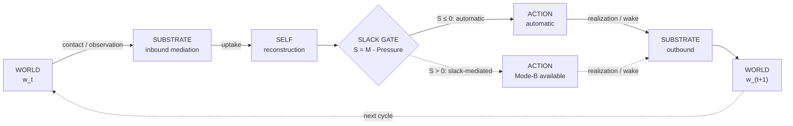
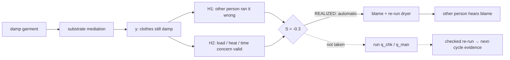
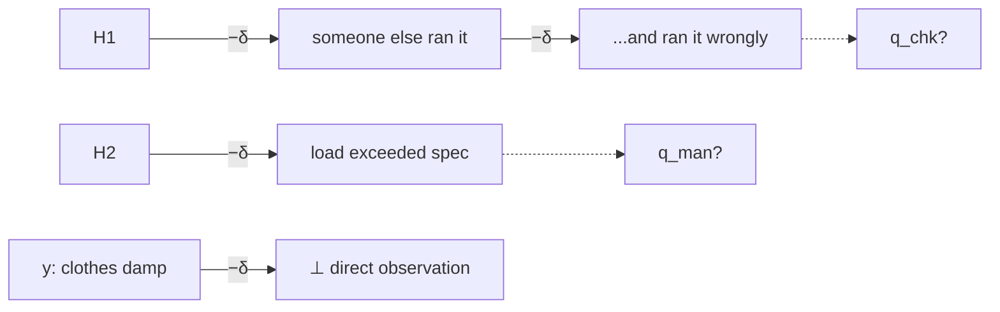

# TLICA–EPIC v0.5.1 — Visual Reading Guide

**Purpose:** a glance-first companion to the full denotational master.  
**Math authority:** [TLICA_EPIC_v0.5.1_MASTER.md](TLICA_EPIC_v0.5.1_MASTER.md).  
**Frozen intake:** [TLICA_EPIC_v0.5.0_MASTER.md](TLICA_EPIC_v0.5.0_MASTER.md).

---

## 1. Read the cycle before the algebra



**Reading order:** world → substrate → self → gate → action → world.

The return leg is later causal time, not inverse transport.

---

## 2. Five questions, not ten disconnected glyphs

| order | question | visual family | read-off |
|---:|---|---|---|
| 1 | **Where did the world touch it?** | contact wire | **κ** — read χ |
| 2 | **How mediated was the arrival?** | substrate vertices | **D** — count mediation stages |
| 3 | **How bound is it into the I?** | weighted integration graph | **ρ** — max-flow from î |
| 4 | **Does verification actually close?** | verification chain + ground + probes | **φ** — count ⇒ to ground; q? adds nothing |
| 5 | **What became action?** | actualization gate | **S** — sign of M − Pressure |

Mnemonic:

> **touch → mediate → integrate → verify → act**

The ten-glyph legend is still the exact reference. These are the five chunks a reader should hold in working memory.

---

## 3. Dryer example — Level 0: story topology

First read only the causal round trip.



At this level the only conclusion is:

> the automatic action was realized before the discriminating-probe action was taken.

No coordinate calculation is needed yet.

---

## 4. Dryer example — Level 1: the three load-bearing facts

### Integration

`H1` is more integrated with the I than `H2` in this declared graph:

- `ρ(H1) = 0.41`
- `ρ(H2) = 0.09`

That tells us **which rival is more bound into the current self-structure**. It does not verify the rival.

### Verification



Read it literally:

- `y` reaches ground, so `φ(y)=0.95`.
- `H1` ends at `q_chk?`, so `φ(H1)` is **undefined**.
- `H2` ends at `q_man?`, so `φ(H2)` is **undefined**.
- `q?` is a visible available route, **not evidence**.

### Actualization

Declared inputs:

```text
M = 1.0
Pressure = 1.3
S = M - Pressure = -0.3
```

Therefore the v0.5 gate reads:

```text
S ≤ 0  →  AUTOMATIC exit realized
```

The stronger psychological bridge from anger to Pressure remains conjectured; the gate arithmetic itself is just the declared diagram read-off.

---

## 5. Dryer example — Level 2: the compact diagnosis

The whole worked example compresses to:

```text
H1: rho = .41, phi = undefined
H2: rho = .09, phi = undefined
gate: S = -.3 → automatic
q_chk?, q_man?: not executed
```

So the diagrammatic pattern called **premature closure** is:

> **a comparatively integrated live rival + an open verification chain + an automatic outbound exit before the discriminator runs.**

This is more precise than “anger made the person irrational,” and it leaves the rival itself free to turn out true or false.

---

## 6. Progressive-disclosure rule

Use three levels in actual work:

### L0 — topology
Show only world → substrate → self → gate → action → world.

### L1 — diagnostic structure
Add only the coordinate pathways that determine the question under study.

### L2 — reference math
Open the full ten-glyph legend, serialization, and computed read-off table.

**Do not put L0, L1, and L2 on the same page unless the task genuinely requires all three.**

That is the main readability correction to the original v0.5 figures.

---

## 7. What should stay off the first page

Keep these in the master/reference layer unless they are the point of the diagram:

- the full claim ledger;
- all four coordinate formulas simultaneously;
- complete serialization;
- source-map edge cases;
- imprinting update equations;
- perturbative/MSR research pointers;
- exact read-off tables for every node.

The diagram is an interface to the formalism, not a replacement for the formalism.

---

## 8. Visual invariant

Every front-door diagram should let a new reader answer these three questions without consulting a legend:

1. **What came in from the world?**
2. **What did the self settle on / carry?**
3. **What went back out into the world?**

Only after those are obvious should the reader be asked to compute κ, D, ρ, φ, or S.
