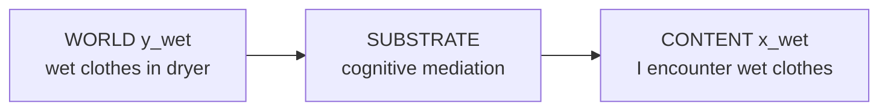
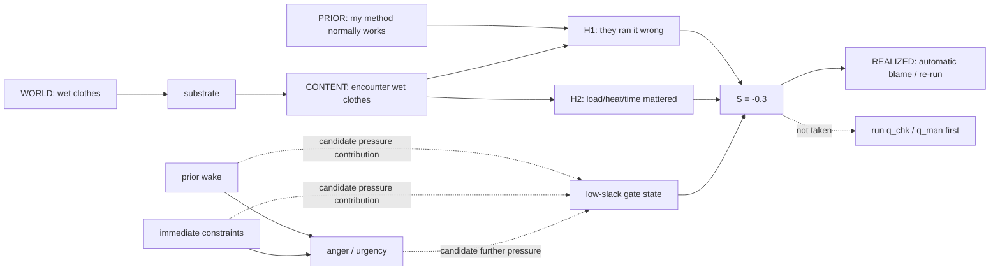
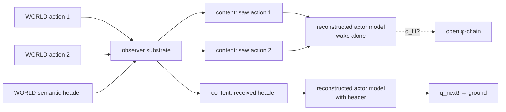

# TLICA–EPIC v0.5.2 — Visual Guide

## 1. World/content typing



World contact and internal content are different objects.

## 2. Corrected dryer chronology



The crucial ordering is **precondition first, dryer encounter second**.

## 3. What the read-offs attach to

```text
WORLD ITEMS:
  n_wake, n_constraints, y_wet, n_other
      │
      └── κ/contact lives here and on mediated contact

SUBSTRATE:
  S_som, S_cog
      │
      └── D counts mediation stages into incoming contents

INTERNAL CONTENTS:
  A, x_wet, P, H1, H2
      │
      ├── ρ reads integration from the cogito
      └── φ reads verification-chain closure

TURNAROUND:
  S = M - Pressure
      └── sign selects automatic vs slack-mediated exit
```

## 4. Corrected semantic wake



The actor's mind never appears as a directly contacted node in the observer's diagram.
